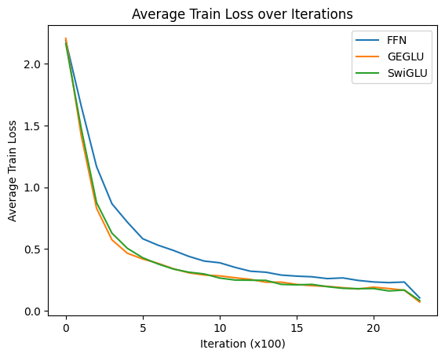
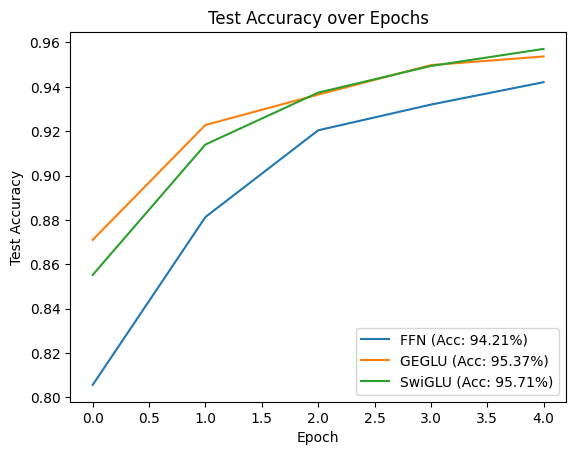
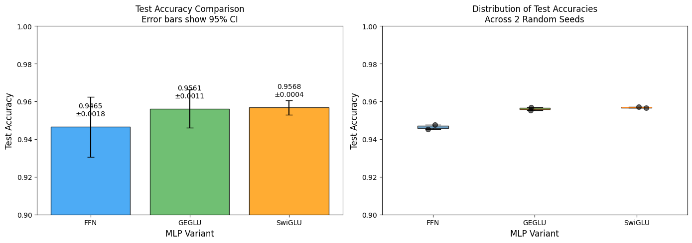

# Robot Learning 2026 — ETH Zürich

Portfolio of the four homework assignments I solved for the **Robot Learning** course at ETH Zürich.

The course goes from PyTorch fundamentals to classical robot control, imitation learning, and deep
reinforcement learning on the SO-100/SO-101 arm in MuJoCo. Each homework required a code submission
**and** a short video where I present my results and defend my reasoning. All four videos are in this
repository.

**Stack:** PyTorch · MuJoCo · Gymnasium · NumPy · Zarr · Stable-Baselines3 · TensorBoard

---

## Overview

| # | Homework | Topic | Headline result |
|---|----------|-------|-----------------|
| 1 | [PyTorch tutorial](hw1_pytorch_tutorial) | Tensors, autograd, MNIST, ViT + GLU ablation | SwiGLU **95.7 %** vs. FFN **94.2 %** at matched parameters |
| 2 | [Robot control & MDPs](hw2_robot_control_mdps) | Inverse kinematics, quintic splines, PID, PPO | Tracking error **0.002–0.009 m** vs. a 0.05 m target |
| 3 | [Imitation learning](hw3_imitation_learning) | Behaviour cloning, action chunking, DAgger, goal conditioning | **88 %** / **96 %** / **82 %** success over 100 episodes |
| 4 | [Reinforcement learning](hw4_reinforcement_learning) | Policy & value iteration, DQN, PPO, SAC | All four algorithms implemented from scratch |

Every video plays inline in the section below. Each one is me presenting my own results.

---

## Homework 1 — PyTorch Tutorial

<video src="https://github.com/user-attachments/assets/3abb0cf3-ffd6-4393-87c2-9a2d7551f79c" controls width="100%"></video>

### Goal

Build the PyTorch foundations for the rest of the course: tensor manipulation, autograd, neural
network training, and a controlled architecture ablation. The final exercise asks a research
question: do **GLU feed-forward variants** ([Shazeer, 2020](https://arxiv.org/pdf/2002.05202))
improve a **Vision Transformer** ([Dosovitskiy et al., 2020](https://arxiv.org/pdf/2010.11929)),
and is the improvement *statistically significant*?

### My solution

- **Ex 1–2:** tensor basics, broadcasting, indexing, autograd, and the core PyTorch API.
- **Ex 3:** an MNIST classifier with a full training and evaluation loop, plus loss and accuracy curves.
- **Ex 4:** a tiny ViT written from scratch — `patchify` → learned patch projection → learned
  positional embedding → pre-LN Transformer blocks → mean pooling → linear head.
  I then swapped only the feed-forward block and compared three variants:

  | Variant | Feed-forward |
  |---------|--------------|
  | `FFN` (baseline) | `Linear → GELU → Linear` |
  | `GEGLU` | `W2( GELU(Wx) ⊙ Vx )` |
  | `SwiGLU` | `W2( SiLU(Wx) ⊙ Vx )` |

  I applied **Shazeer's 2/3 rule** (`d_ff_gated = 2/3 · d_ff`) so the gated variants keep the same
  parameter count as the baseline: **104,842** parameters for FFN against **103,946** for both GLU
  variants, a 0.9 % difference caused only by bias terms. Without this the comparison would only show
  that more parameters help. I picked GEGLU and SwiGLU because they reach the best perplexities in
  the paper.

- **Statistical significance:** a single seed is not evidence. I re-ran every variant across seeds
  and reported the mean with a 95 % confidence interval.

### Results

| Variant | Final test accuracy (5 epochs) | Mean ± 95 % CI across seeds |
|---------|-------------------------------|------------------------------|
| FFN     | 94.21 % | 0.9465 ± 0.0018 |
| GEGLU   | 95.37 % | 0.9561 ± 0.0011 |
| SwiGLU  | **95.71 %** | **0.9568 ± 0.0004** |

<p align="center">
  
  
</p>
<p align="center">
  
</p>

Both gated variants beat the baseline at equal parameter count, and both converge faster. The gap
between GEGLU and SwiGLU is inside the confidence intervals, so I do not claim a winner between them.

---

## Homework 2 — Robot Control and MDPs

<video src="https://github.com/user-attachments/assets/a8177a1f-3885-4a7d-a3b6-5cdcf6d0f287" controls width="100%"></video>

### Goal

Move an SO-100 arm along a **Lemniscate of Bernoulli** (infinity sign) in three ways of increasing
autonomy: pure kinematics, classical feedback control, and a learned policy.

### My solution

**Ex 1 — Inverse kinematics.** I generate the 3D keypoint set from the lemniscate parametrisation
and solve IK with **Damped Least Squares**:

```
q̇ = Jᵀ (J Jᵀ + λI)⁻¹ e
```

I solve the linear system with `np.linalg.solve` instead of inverting the matrix, which is faster
and numerically safer. I also clamp `q̇` to avoid overshoot near singularities.

**Ex 2 — Trajectory generation and PID.** I implemented the quintic time-scaling polynomial
`s(t) = 10t³ − 15t⁴ + 6t⁵` for smooth waypoint interpolation (zero velocity and acceleration at both
ends), and a PID law on the joint tracking error that feeds `data.ctrl` in MuJoCo.

**Ex 3 — RL environment (MDP).** I implemented the environment building blocks for a PPO policy that
tracks random targets:

- randomised robot reset and target sampling,
- action processing from the normalised `[-1, 1]` policy output to joint limits,
- a reward that combines a **dense** shaping term `exp(-2·e)` with a **sparse** bonus for
  `e < 0.005`,
- an observation transformed from the world frame into the **robot base frame** using quaternion
  algebra, so the policy is invariant to where the robot stands in the world.

### Results and theory

The video shows the arm tracking the lemniscate under IK, then under PID control, then the trained
PPO policy tracking random targets. The evaluation printout gives final end-effector tracking errors
between **0.0023 and 0.0088 m** across episodes, roughly an order of magnitude below the 0.05 m pass
threshold. It also covers the theory questions: what breaks when the lemniscate grows
beyond the workspace, how the IK time step trades convergence against overshoot, why a large `K_P`
causes oscillation and how `K_D` damps it, and when a non-zero `K_I` is needed.

---

## Homework 3 — Imitation Learning

<video src="https://github.com/user-attachments/assets/9e48f809-d226-4c97-9394-589bf87cc6f0" controls width="100%"></video>

### Goal

Teleoperate an SO-101 arm in simulation, record demonstrations, and train policies that imitate them.
Three tasks of increasing difficulty: pick a cube and place it in a bin around an obstacle, make that
policy robust out of distribution with **DAgger**, and finally solve a randomised
**goal-conditioned multi-cube** task (a graded competition with a leaderboard).

### My solution

All policies predict **action chunks** of 16 steps and train with an MSE loss. I chose end-effector
control (`action_ee_xyz` + `action_gripper`) to keep the learning problem small.

**Ex 1 — `ObstaclePolicy`.** A compact MLP (`d_model = 256`, depth 3, LayerNorm + dropout) that maps a
10-dimensional state — end-effector xyz, gripper, cube xyz, obstacle xyz — to a flat
`chunk_size × action_dim` output. Trained with AdamW, cosine learning-rate decay, gradient clipping,
and a validation split for checkpoint selection.

**Ex 2 — DAgger.** The same policy fails when the obstacle distribution shifts. I ran the
`observe failure → intervene with expert actions → recompute actions → retrain` loop, targeting the
states where the policy actually went out of distribution instead of collecting more of the same data.

**Ex 3 — `MultiTaskPolicy`.** This is where I invested the most design effort. Three ideas:

1. **Structured input with inductive bias.** Instead of feeding the raw state, I use the goal one-hot
   to *select* the target cube, separate the distractor cubes, and append the two vectors the task is
   really about: `ee → target_cube` and `target_cube → bin`. The network no longer has to learn
   coordinate subtraction from data.
2. **FiLM conditioning.** The goal (colour one-hot + bin position) is encoded once and modulates every
   residual block through per-channel `γ` and `β`. I initialise `γ` at 1 so the signal survives the
   first steps of training. Conditioning applies at every depth, not only at the input.
3. **Colour-permutation augmentation.** The task is symmetric under relabelling the cube colours.
   I permute the three cube slots together with the goal one-hot, which turns every recorded episode
   into six, at zero teleoperation cost. This was the cheapest large gain in the whole homework.

### Results

Official evaluation, 100 episodes, seed 42:

| Exercise | Task | Success rate | Score |
|----------|------|--------------|-------|
| 1 | Single cube + obstacle (train distribution) | **88 %** | 100 / 100 |
| 2 | Single cube + obstacle (adversarial, after DAgger) | **96 %** | 100 / 100 |
| 3 | Multi-cube goal-conditioned (randomised cubes and bin) | **82 %** | 82 / 100 |

For exercise 3 the course considered a success rate approaching **50 %** to be very strong. The
structured input, FiLM conditioning, and symmetry augmentation reached **82 %** without excessive
teleoperation.

---

## Homework 4 — Reinforcement Learning

<video src="https://github.com/user-attachments/assets/b76d7be6-ecc3-41c1-bcd4-febdf4e59f59" controls width="100%"></video>

### Goal

Implement the four canonical RL algorithms from scratch and compare them: exact dynamic programming
on a tabular MDP, value-based deep RL on a continuous state space, and both on-policy and off-policy
continuous control on the SO-100 arm.

### My solution

**Ex 1 — Dynamic programming (Cliff Walking).** Policy evaluation, policy improvement, the policy
iteration loop, the value iteration update, and greedy policy extraction. I studied the effect of
stochasticity by sweeping `slip_chance ∈ {0.0, 0.01, 0.2}`: the optimal policy moves from hugging the
cliff to a conservative route along the upper rows, because the risk-aware Bellman backup propagates
the −100 penalty into every cliff-adjacent state.

**Ex 2 — DQN (CartPole).** Replay buffer, Q-network, ε-greedy action selection, and the TD target
`r + γ·max_a' Q_target(s', a')·(1 − done)` with a periodically synchronised target network.
Tuned hyper-parameters: `lr = 2e-3`, `ε = 0.01`, `target_update = 50`, `hidden_dim = 128`.

**Ex 3 — PPO (SO-100 tracking).** Gaussian policy sampling with log-probabilities, the analytic KL
divergence between old and new Gaussians (used for adaptive learning-rate control and early
stopping), the clipped surrogate loss, the clipped value loss, the entropy bonus, and the full
actor–critic update with GAE(λ) and gradient clipping.

**Ex 4 — SAC (same task).** Squashed Gaussian sampling, the twin-critic Bellman target with the
entropy term `min(Q1', Q2') − α·log π(a'|s')`, the actor objective `E[α·log π − min(Q1, Q2)]`,
automatic temperature tuning through the `α` loss, and Polyak soft updates of the target critics.

### Results and theory

The video walks through the state-value and optimal-policy visualisations for each `slip_chance`,
the DQN training curve and evaluation summary, and the TensorBoard curves plus evaluation summaries
for PPO and SAC on the tracking task. It also covers the theory: why experience replay and a target
network stabilise DQN, how Double DQN removes the overestimation bias of the `max` operator, why PPO
clips the ratio instead of solving a TRPO trust region, what GAE `λ` trades off, why the `tanh`
squash needs a log-probability correction, and the update-to-data ratio that explains the
sample-efficiency gap between on-policy PPO and off-policy SAC.

---

## Repository layout

```
hw1_pytorch_tutorial/      Notebooks (ex1–ex4), result plots, video
hw2_robot_control_mdps/    exercises/ (IK, splines + PID, RL env), scripts/, MuJoCo assets, video
hw3_imitation_learning/    hw3/ (model, dataset, sim env), scripts/ (teleop, train, eval, DAgger),
                           checkpoints ex1–ex3.pt, official .hwresult files, video
hw4_reinforcement_learning/ exercises/ (MDP, DQN, PPO, SAC), rl/, envs/, scripts/, video
```

Each homework folder keeps its original assignment `README.md` with the setup instructions, the task
description, and my written answers to the theory questions.

---

## Author

**Tomás Gadea** — Robot Learning, ETH Zürich, spring 2026.
